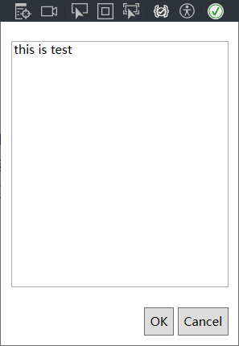
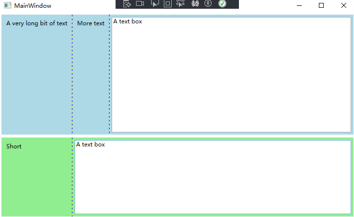

# WPF-布局

## 1. 布局原则

+ WPF只能包含单个元素，需要在窗口上放置一个容器，然后在这个容器中添加其它元素；
+ 不应显式的设定元素（如控件）的尺寸，元素可以改变大小来适合他们的内容；如果有需求，可以使用最大、最小尺寸来约束；
+ 不应使用屏幕坐标来指定元素的位置。修改页面会造成布局混乱；
+ 布局容器的子元素”共享“可用的空间；元素根据约束条件自动占据空间；
+ 可嵌套的布局容器

## 2. 布局过程

+ 布局分为两个阶段：

    1. 测量：容器遍历所有子元素，并询问所有子元素他们所期望的尺寸；

    2. 排列：容器在合适位置放置子元素；

+ 核心布局面板：

    | 名称       | 说明                                           |
    | ---------- | ---------------------------------------------- |
    | StackPanel | 以水平或垂直的方式按照堆栈的方式进行元素放置； |
    | WrapPanel  | 自左到右或自上而下的换行放置；                 |
    | DockPanel  | 根据指定方向适应页面进行放置；                 |
    | Grid       | 根据不可见的表格进行放置；                     |
    | Canvas     | 使用绝对坐标放置元素；                         |

## 3. StackPanel布局

### 3.1 demo

+ 默认竖直放置：

```xaml
<StackPanel>
    <Label Content="button stack sample"/>
    <Button Content="btn1"/>
    <Button Content="btn2"/>
    <Button Content="btn3"/>
</StackPanel>
```

+ 改为水平放置：

```xaml
<StackPanel Orientation="Horizontal">
    <Label Content="button stack sample"/>
    <Button Content="btn1"/>
    <Button Content="btn2"/>
    <Button Content="btn3"/>
</StackPanel>
```

### 3.2 布局属性

| 名称                | 说明                                                         |
| ------------------- | ------------------------------------------------------------ |
| HorizontalAlignment | 竖直放置下，指定center、left、right或stretch；               |
| VerticalAlignment   | 水平放置下，指定center、top、bottom、strech；                |
| Margin              | 指定该元素与周围元素的距离；Margin=“1,2,3,4” 左边距为1，上边距为2，右边距为3，下边距为4； |
| MinWidth、MinHeight | 最小宽度与最小高度；                                         |
| MaxWidth、MaxHeight | 最大宽度与最大高度；                                         |
| Width、Height       | 显示指定元素宽度、高度；                                     |

### 3.3 Border控件

Border控件不是布局面板，经常与布局面板一起使用；

Border只能包含一段嵌套内容，通常是布局面板，并为其添加背景或在其周围添加边框；

| 名称                        | 说明                                             |
| --------------------------- | ------------------------------------------------ |
| Background                  | 使用Brush对象设置边框中所有内容背景；            |
| BorderBrush、BorderThicknes | 设置边框颜色和边框宽度；                         |
| CornerRadius                | 设置边框圆角，值越大、边框越明显；               |
| Padding                     | 设置Border内部元素与边框之间距离，与Margin相对； |

demo：

```xaml
<Border Margin="5" Padding="5" Background="LightBlue" BorderBrush="SteelBlue" BorderThickness="3" CornerRadius="10">
    <StackPanel Orientation="Vertical" Margin="20">
        <Label Content="button stack sample"/>
        <Button Content="btn1" Margin="5"/>
        <Button Content="btn2" Margin="5"/>
        <Button Content="btn3" Margin="5"/>
    </StackPanel>
</Border>
```


## 4.  WrapPanel和DockPanel面板

### 4.1 WrapPanel面板

以一行或一列的方式排列元素，区别在于该面板下行、列的大小由面板中元素weigh、height决定；

与StackPanel面板类似，WrapPanel实际上主要用来控制用户界面中一小步分的布局细节，并非用于控制整个窗口布局。

例如，可使用WrapPanel面板以类似工具栏控件的方式将所有按钮保持在一起；

Wrap面板是唯一一个不能通过灵活使用Grid面板代替的面板；

```xaml
<WrapPanel>
    <Button Content="btn1" VerticalAlignment="Top"/>
    <Button Content="btn2" MinHeight="60"  />
    <Button Content="btn3" VerticalAlignment="Bottom"/>
</WrapPanel>
```

### 4.2 DockPanel面板

可以指定面板中元素放置在指定的边，最后一个元素占据所有剩余空间；

多拍个元素被指定到同一个边缘时，根据声明的顺序放置；

```xaml
<DockPanel>
    <Button Content="top btn" DockPanel.Dock="Top" />
    <Button Content="left btn" DockPanel.Dock="Left" />
    <Button Content="right btn" DockPanel.Dock="Right" />
    <Button Content="bottom btn" DockPanel.Dock="Bottom" />
    <Button Content="remaining space" />
</DockPanel>
```

### 4.3 嵌套布局

很少单独使用stackpanel、wrappanel、dockpanel面板，通常用来设置一部分用户界面；

demo：

```xaml
<DockPanel>
    <StackPanel DockPanel.Dock="Bottom" HorizontalAlignment="Right" Orientation="Horizontal">
        <Button Content="OK" Margin="10,10,2,10" Padding="5"/>
        <Button Content="Cancel" Margin="2,10,10,10" Padding="5"/>
    </StackPanel>
    <TextBox DockPanel.Dock="Top" Margin="10"> this is test</TextBox>
</DockPanel>
```



## 5. Grid面板

### 5.1 基本概念

Grid面板将元素分隔到不可见的行列网格中；

尽管可在一个单元格中放置多个元素（此时会互相重叠），但建议每个单元格中只放置一个元素通常更合理，使此单元格包含其它控件；

使用步骤：1.划分合适数量的行和列；2.在指定单元格放置元素；

三行两列demo：

```xaml
<Grid ShowGridLines="True">
    <Grid.RowDefinitions>
        <RowDefinition/>
        <RowDefinition/>
        <RowDefinition/>
    </Grid.RowDefinitions>
    <Grid.ColumnDefinitions>
        <ColumnDefinition/>
        <ColumnDefinition/>
    </Grid.ColumnDefinitions>
</Grid>
```

### 5.2 调整行和列

三种调整方式：

+ 绝对设置尺寸方式：基本不用；

```xaml
<ColumnDefinition Width="100"/>
```

+ 自动尺寸设置：根据网格内元素大小自适应网格大小；

```xaml
<ColumnDefinition Width="Auto"/>
```

+ 按比例设置尺寸方式：按照给定比例设置网格在页面中的大小；

第一行占比：0.4/（0.4*0.6+0.3）;第二行占比：0.6/（0.4+0.6+0.3）；...

```xaml
<RowDefinition Height="0.4*"/>
<RowDefinition Height="0.6*"/>
<RowDefinition Height="0.3*"/>
```

### 5.3 布局舍入

问题：有时自动计算会产生非整数的像素大小，会造成页面显示模糊；

解决方法：添加属性如UseLayoutRounding;

```xaml
<Grid UseLayoutRounding="True">
```

原理：配置该属性后，WPF会确保布局容器内所有内容对齐到最近的像素边界；

### 5.4 跨越行和列

情景：元素希望同时占据Grid栅格中多个行或列；

操作：配置属性RowSpan/ColumnSpan;

```xaml
<Grid UseLayoutRounding="True">
    <Grid.RowDefinitions>
        <RowDefinition Height="0.4*"/>
        <RowDefinition Height="0.6*"/>
        <RowDefinition Height="0.3*"/>
    </Grid.RowDefinitions>
    <Grid.ColumnDefinitions>
        <ColumnDefinition Width="Auto"/>
        <ColumnDefinition Width="Auto"/>
    </Grid.ColumnDefinitions>
    <Label Grid.Row="0" Grid.Column="0" Grid.RowSpan="2"  Grid.ColumnSpan="2" Content="label"/>
</Grid>
```

### 5.5 分割窗口

情景：页面中有两个相邻控件，希望拖拽两个控件之间的分割线调整两个控件的大小；

方法：使用GridSpliter对象；

> 注意事项：
>
> 1. GridSpliter必须放在Grid单元格中；一般预留一列或一行专门用于防止GridSpliter对象，并将预留行或列的Heigh或Width设为Aurto；
> 2. 尽管只把GridSpliter放置在Grid某一个单元格中，但其发挥作用还是针对整行、整列；为使作用效果与显示效果一致，可使其占据整行、整列；
> 3. 为了易于观察到GridSpliter，可将其Width、Heigh设为固定值；
> 4. 分割方式：水平分割：设置HorizontalAlignment="Center"；竖直分割：VerticalAlignment="Center"；
> 5. 使用ShowsPreview属性可改变显示效果：灰色引用拖动，左键松开后分割完成；

### 5.6 共享尺寸组

情景：保持用户界面独立部分的一致性；例如可以使独立的Grid控件具有相同的比例；

界面效果：



+ 代码开发：

    + 注意事项;
        + 顶层Grid要配置Grid.IsSharedSizeScope="True"；
        + 在顶层Grid下的相同名称共享尺寸组才有效；
        + 也可以使用其它容器，如DockPanel、StackPanel；
    + 代码示例：

    ```xaml
    <Grid Grid.IsSharedSizeScope="True">
        <Grid.RowDefinitions>
            <RowDefinition Height="0.6*"/>
            <RowDefinition Height="0.4*"/>
        </Grid.RowDefinitions>
        <Grid Grid.Row="0" Background="LightBlue" ShowGridLines="True" Margin="3">
            <Grid.ColumnDefinitions>
                <ColumnDefinition Width="auto" SharedSizeGroup="TextLabel"/>
                <ColumnDefinition Width="auto"/>
                <ColumnDefinition/>
            </Grid.ColumnDefinitions>
            <Label Margin="5">A very long bit of text</Label>
            <Label Grid.Column="1" Margin="5">More text</Label>
            <TextBox Grid.Column="2" Margin="5">A text box</TextBox>
        </Grid>
        <Grid Grid.Row="1" Margin="3" Background="LightGreen" ShowGridLines="True">
            <Grid.ColumnDefinitions>
                <ColumnDefinition Width="auto" SharedSizeGroup="TextLabel"/>
                <ColumnDefinition/>
            </Grid.ColumnDefinitions>
            <Label Margin="5">Short</Label>
            <TextBox Grid.Column="1" Margin="5">A text box</TextBox>
        </Grid>
    </Grid>
    ```

    ## 6.Canvas面板

    ### 6.1 基本概念

    + Canvas面板允许使用精确的坐标放置元素；如果设计数据驱动的富窗体和标准对话框，这并非好的选择；但如果构建其它一些不同的内容（如为图形工具构建绘图表面），canvas会比较合适；
    + Canvas中如何定位元素：设置Canvas.Left和Canvas.Top属性；

    ```xaml
        <Canvas ClipToBounds="True">
            <Button Canvas.Left="10" Canvas.Top="10">(10, 10)</Button>
            <Button Canvas.Left="50" Canvas.Top="70">(50, 70)</Button>
            <Button Canvas.Left="60" Canvas.Top="160">(60, 160)</Button>
        </Canvas>
    ```

    注意：为避免该面板下元素超出canvas面板，可设置ClipToBounds="True"；

    ### 6.2 Z顺序

+ 如果Canvas面板中有多个互相重叠的元素，可设置Canvas.Index属性控制上下顺序；
+ 默认情况下，Index值都为0，会按照代码前后顺序进行显示；（后声明的在上面）
+ 设置后，Index值大的会显示在上面；
